تابع LSR_Iterative 
-------------------

این تابع به دو صورت متفاوت نوشته شده است. در صورت اول این تابع با دریافت تعداد
Epoch پس از تکرار آموزش داده متوقف می شود که در زیر آمده است.این کد در فایل
2_2.py می باشد

def LSR_Iterative(landa,xtrain, ytrain, epoch):  
ERMS = []  
cost = costfunc(xtrain, ytrain, weight)  
ERMS.append(cost)  
for i in range(epoch):  
for j in range(len(xtrain)):  
y = weight[1]\*xtrain[j]+weight[0]  
weight[0] = weight[0] + landa \* (ytrain[j]-y)  
weight[1] = weight[1] + landa \* (ytrain[j]-y) \*xtrain[j]  
cost = costfunc(xtrain, ytrain, weight)  
print(cost)  
ERMS.append(cost)  
plt.clf()  
plt.plot(trainx, trainy, 'o', mfc='r', mec='r' )  
axes = plt.gca()  
yline=[]  
for k in axes.get_xlim():  
yline.append(weight[0]+weight[1]\*k)  
plt.plot(axes.get_xlim(), yline)  
plt.xlabel('train X')  
plt.ylabel('train Y')  
plt.show()  
  
plt.title('EMRS vs Iteration')  
plt.xlabel("Iteration")  
plt.ylabel('ERMS')  
plt.plot(ERMS)  
plt.show()

در این تابع با قرار دادن مقدار 20 برای تعداد Epoch ده بار الگوریتم کل داده ها را
می بیند و سعی در بهبود خود می کند. که در تصاویر زیر نمونه خط کشیده شده در مرحله
اول و مرحله آخر نشان داده شده است.

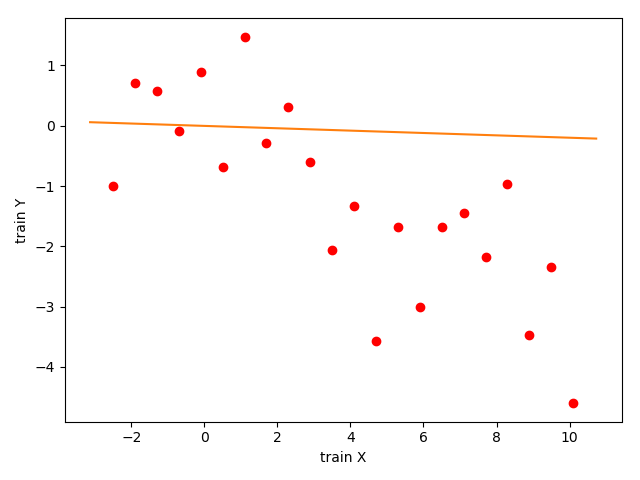

*شکل 2 مرحله اول آموزش برای دادگان اول*

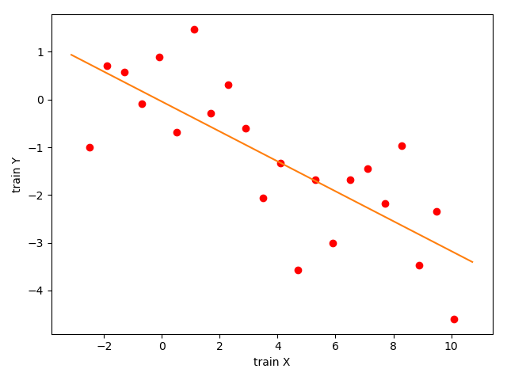

*شکل 3 مرحله بیستم آموزش برای دادگان اول*

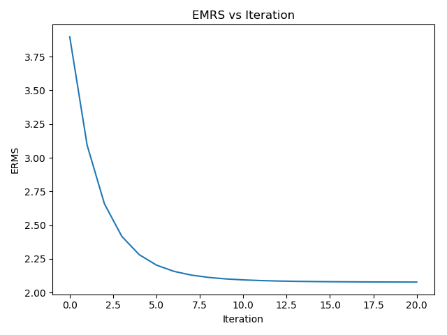

شکل 4 مقدار EMRS در بیست دوره مختلف آموزش با نرخ یادگیری 0005/0 *برای دادگان
اول*

شکل 5 *مرحله اول آموزش برای دادگان دوم*

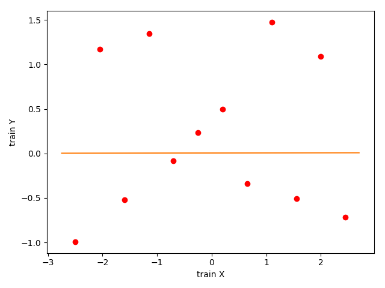

شکل 6 *مرحله بیستم آموزش برای دادگان دوم*

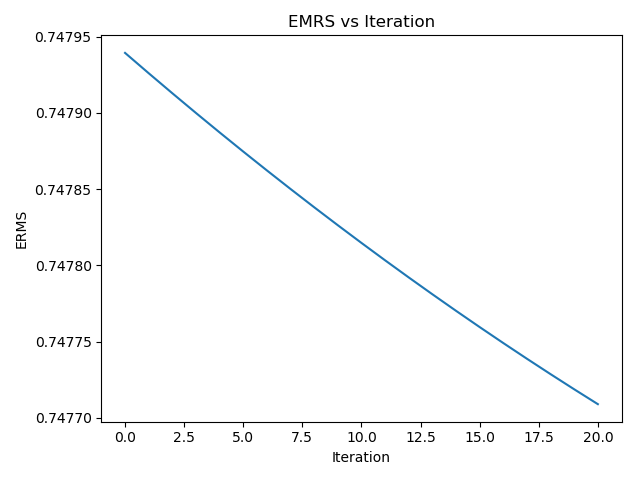

شکل 7 مقدار EMRS در بیست دوره مختلف آموزش با نرخ یادگیری 0005/0 *برای دادگان
دوم*

در حالات بالا نرخ یادگیری برابر 0005/0 می باشد که با بزرگتر کردن آن به مقدار
01/0 نمودار خطای آن پس از چند مرحله صعودی می شود. که بهترین میزان خطا 67/2% است
که در مرحله اول بدست آمده است.

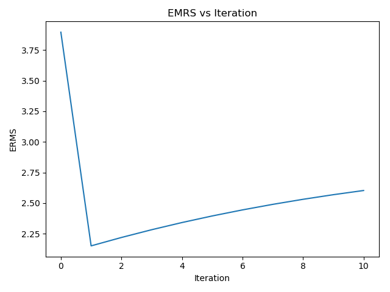

*شکل 8 میزان خطا در حالتی که نرخ یادگیری برابر 01/0 می باشد.*

حالت دیگر این تابع با تعیین شرط میزان خطای تخمین پایان می یابد. که در زیر آمده
است.

def LSR_Iterativeemrs(landa,xtrain, ytrain, emrs):  
ERMS = []  
Cost = 100  
it =0  
while (it \< 100) & (Cost \> emrs):  
it += 1  
  
for j in range(len(xtrain)):  
y = weight[1]\*xtrain[j]+weight[0]  
weight[0] = weight[0] + landa \* (ytrain[j]-y)  
weight[1] = weight[1] + landa \* (ytrain[j]-y) \*xtrain[j]  
Cost = costfunc(xtrain, ytrain, weight)  
print(Cost)  
ERMS.append(Cost)  
plt.clf()  
plt.plot(trainx, trainy, 'o', mfc='r', mec='r' )  
axes = plt.gca()  
yline=[]  
for k in axes.get_xlim():  
yline.append(weight[0]+weight[1]\*k)  
plt.plot(axes.get_xlim(), yline)  
plt.xlabel('train X')  
plt.ylabel('train Y')  
plt.show()  
  
plt.title('ERMS vs Iteration')  
plt.xlabel("Iteration")  
plt.ylabel('ERMS')  
plt.plot(ERMS)  
plt.show()

این تابع با مقدار emrs = 0 هیچوقت به پایان نمی رسد. و تابع تا اتمام حافظه رم به
رفع خطا ادامه خواهد داد. اما با قرار دادن emrs = 2.3 این برنامه پس از 20 مرحله
آموختن کل داده ها متوقف می شود

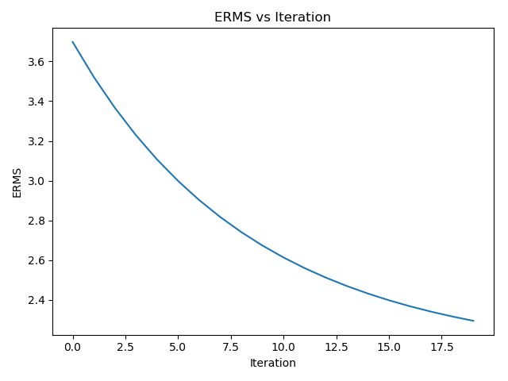

*شکل 9 مقادیر EMRS با شرط پایان کمتر از 2.3*

تابع LSR_NonIterative که با دریافت داده های ورودی رگراسیون خطی غیرتکراری را اجرا کرده و خطی را برای داده ها تقریب می زند.
-------------------------------------------------------------------------------------------------------------------------

تابع نوشته شده در فایل 2_3.py قرار دارد.

def LSR_NonIterative(xtrain, ytrain):  
weight = np.array([0,0],np.float64)  
weight[1] = np.sum( (ytrain - np.mean(ytrain)) \* (xtrain -
(np.mean(xtrain))))/np.sum(np.power( xtrain - np.full(xtrain.shape,
np.mean(xtrain)),2))  
weight[0] = np.mean(ytrain - weight[1]\*xtrain)  
print(weight)  
plt.clf()  
plt.plot(trainx, trainy, 'o', mfc='r', mec='r')  
axes = plt.gca()  
yline = []  
for k in axes.get_xlim():  
yline.append(weight[0] + weight[1] \* k)  
plt.plot(axes.get_xlim(), yline)  
plt.xlabel('train X')  
plt.ylabel('train Y')  
plt.show()

که خروجی آن برای دو دادگان به صورت زیر است.

شکل 10 خروجی تابع LSR_NonIterative برای دادگان اول

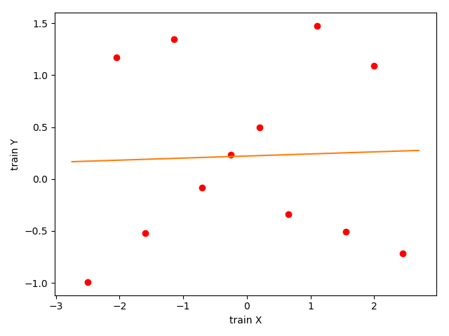

شکل 11 خروجی تابع LSR_NonIterative برای دادگان دوم

نتایج حاصل از دو تابع LSR_Iterative و LSR_NonIterative را مقایسه کنید؟ و در یک نمودار برای داده ها رسم کنید. (برای هر دو دادگان انجام شود)
------------------------------------------------------------------------------------------------------------------------------------------

کد های این مقایسه در فایل 2_4.py می باشد که خروجی آن به صورت زیر است.

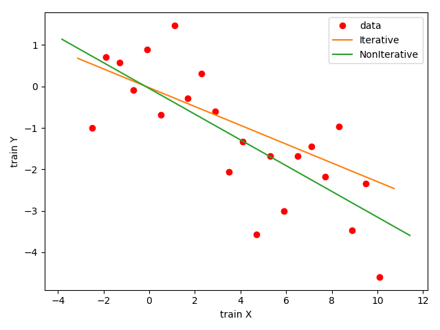

شکل 12 نتیجه مقایسه دو تابع LSR_Iterative و LSR_NonIterative برای دادگان اول

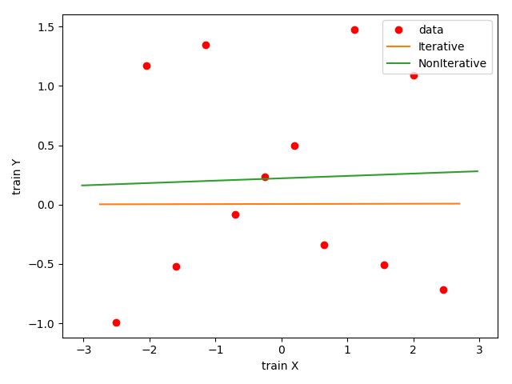

شکل 13 نتیجه مقایسه دو تابع LSR_Iterative و LSR_NonIterative برای دادگان دوم

نحوه فراخوانی و استفاده از تابع polyfit در کتابخانه  scipyیا **numpy** را مشخص کرده و سپس با استفاده از آن یک خط و یک منحنی با درجه 7 برای دادهها تقریب بزنید و رسم نمایید. (مشابه شکل زیر فقط برای دادگان (getdata(برای هر دو دادگان انجام شود)
------------------------------------------------------------------------------------------------------------------------------------------------------------------------------------------------------------------------------------------------

**numpy.polyfit(x, y, deg, rcond=None, full=False, w=None,
cov=False)**

def mmtpolyfit(X,Y,degree):  
poly = np.polyfit(X,Y,degree)  
Polyid = np.poly1d(poly)  
plt.plot(X, Y, 'o', mfc='r', mec='r')  
plt.plot(X, Polyid(X))  
plt.legend(["data"])  
plt.show()  
return Polyid

این قسمت در فایل 2_5.py نوشته شده است که خروجی آن به شرح زیر است.

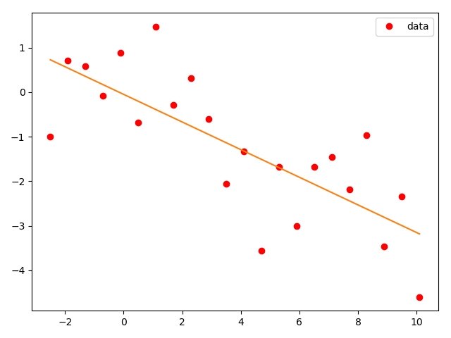

شکل 14 استفاده از تابع پلی فیت با درجه 1 برای دادگان اول

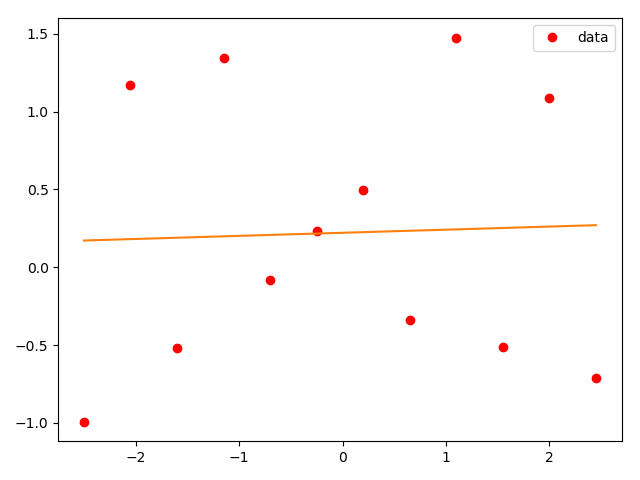

شکل 15 استفاده از تابع پلی فیت با درجه 1 برای دادگان دوم

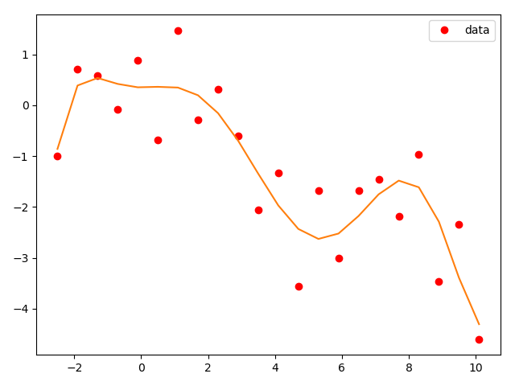

شکل 16 استفاده از تابع پلی فیت با درجه7 برای دادگان اول

شکل 17 استفاده از تابع پلی فیت با درجه 7 برای دادگان دوم

تابع polyfit
------------

این قسمت در فایل 2_6.py قرار دارد.

def costfunc(x, y, poly):  
emrs = []  
for i in range(len(poly)):  
Polyid = np.poly1d(poly[i])  
inner = np.power(Polyid(x) - y, 2)  
smm = np.sum(inner)  
emrs.append(np.sqrt(np.sum(smm) / 2\*(len(y))))  
plt.plot(range(len(poly)), emrs)  
plt.legend(["EMRS"])  
plt.show()  
  
  
trainx, validationx, testx, trainy, validationy, testy = getdata1()  
  
  
def mmtpolyfit(X, Y, degree):  
poly = np.polyfit(X, Y, degree)  
Polyid = np.poly1d(poly)  
return poly  
  
  
ply = []  
for i in range(20):  
ply.append(mmtpolyfit(trainx, trainy, i))  
costfunc(validationx, validationy, ply)

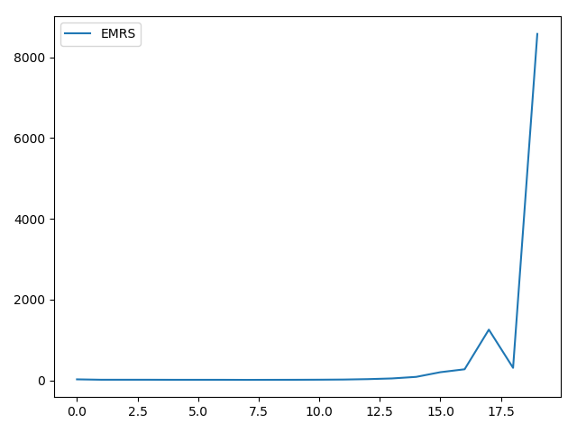

شکل 18 میزان EMRS برای درجه های پلی فیت 1 تا 20 برای دادگان اول

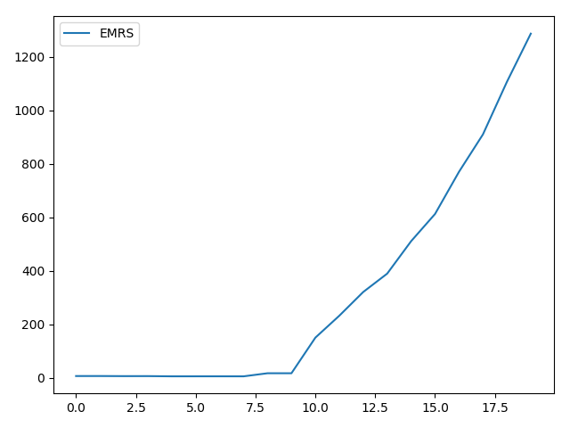

شکل 19 شکل 20 میزان EMRS برای درجه های پلی فیت 1 تا 20 برای دادگان اول

1.  درج کمترین خطا

این قسمت در فایل 2_7.py نوشته شده است که خروجی آن به شرح زیر است.

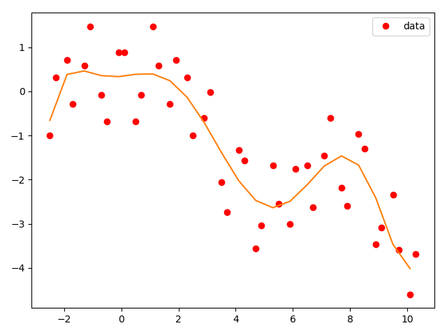

شکل 21 رسم بهترین تقریب برای دادگان اول

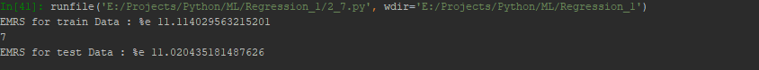

شکل 22 محاسبه خطای تقریب برای داده test

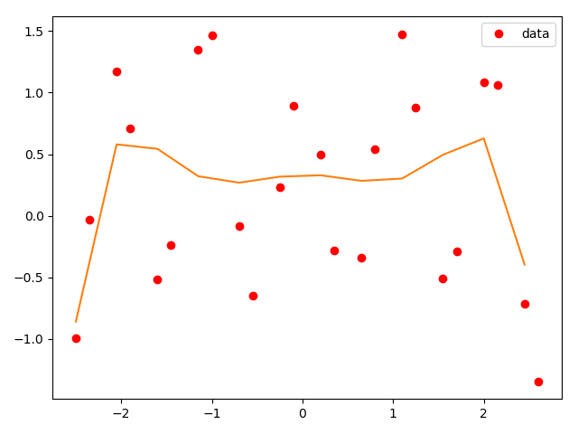

شکل 23 رسم بهترین تقریب برای دادگان دوم

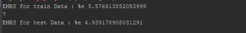

شکل 24 محاسبه خطای تقریب برای داده test
